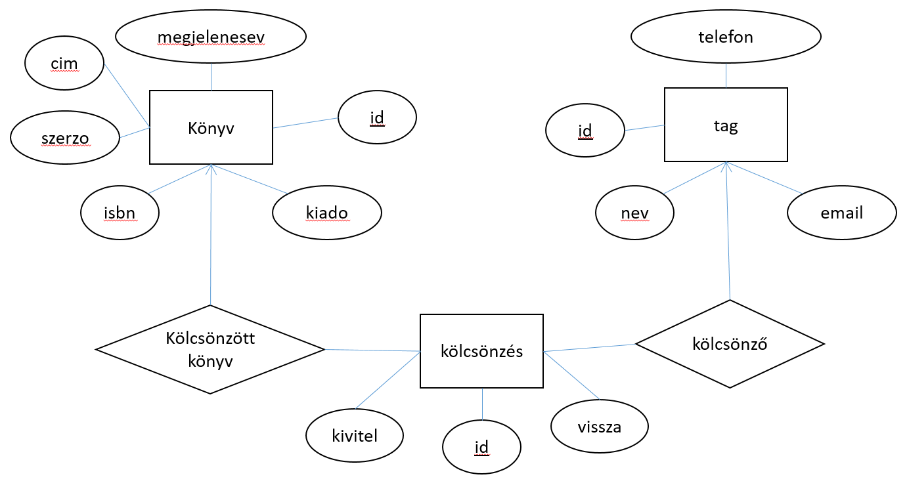

# Könyvtáradatbázis
Informatika 2 – minta házi feladat
 
# Specifikáció
## Feladat leírása
A feladat célja egy könyvtári kölcsönzéseket tartalmazó adatbázis karbantartása. A könyvtárban tárolni szeretnénk az elérhető könyvek listáját és a beiratkozott tagokat. Cél, hogy a kölcsönzéseket is karbantarthassuk, azok kiviteli és visszahozatali dátumával.

## Elérhető funkciók
Az alkalmazás a következő funkciókat biztosítja:
 * Könyvek kezelése:
    * Új könyv létrehozása
    * Meglévő könyv adatainak módosítása
    *  Könyvek törlése
    * Az adatbázisban tárolt könyvek listázása, keresés a könyvek címe alapján.
* Tagok kezelése:
    * Új tagok létrehozása
    * Meglévő tagok adatainak módosítása
    * Tagok törlése
    * Az adatbázisban tárolt tagok listázása
* Kölcsönzések kezelése:
    * Új kölcsönzés létrehozása – csak olyan könyvet lehet kivenni, ami jelenleg bent van a könyvtárban. 
    * Korábbi kölcsönzés törlése.
    * Kölcsönzött könyv visszahozása.
## Adatbázis séma
Az adatbázisban a következő entitásokat és attribútumokat tároljuk:
 * Könyv: isbn szám, cím, szerző, kiadó, megjelenés éve
 * Tag: név, email cím, telefonszám
 * Kölcsönzés: tag, könyv, kivitel dátuma, visszahozatal dátuma

A fenti adatok tárolását az alábbi sémával oldjuk meg:

 