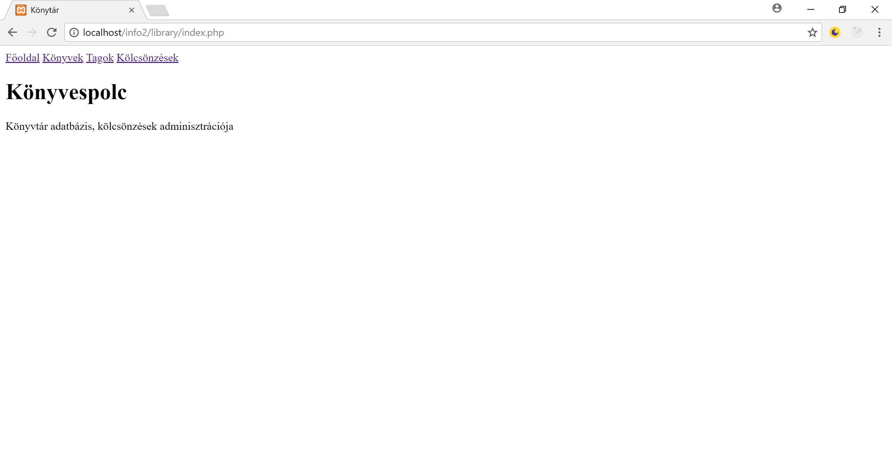

# PHP Webalkalmazás elkészítése - hallgató segédlet

Az alábbi leírás a webalklamazás implementációját és működését mutatja be. Célja, hogy érthető legyen az alkalmazás felépítése és működése. 

## Sitemap - az alkalmazás struktúrája
Az alkalmazást több különböző PHP fájl valósítja meg: 
* `index.php`: ez a főoldal, ahol megjelenik az oldal címe és linkek az egyes aloldalakra.
* `books.php`: ez az oldal megjeleníti a könyveket és lehetőség van új könyv létrehozására.
* `edit-book.php`: ezen a oldalon egy-egy könyvet lehet szerkeszteni
* `members.php`: ez az oldal megjeleníti az adatbázisban tárolt tagok listáját, ugyanitt lehet új tagok létrehozni.
* `edit-member.php`: ezen az oldalon egy-egy tag adatait lehet szerkeszteni.
* `lendings.php`: ez az oldal megjeleníti a jelenlegi kölcsönzéseket, ugyanitt lehet új kölcsönzést indítani.
* `edit-lending.php`: ezen az oldalon lehet egy-egy kölcsönzés adatait módosítani. 

A fentieken kívül néhány további segédfájlt is fogunk használni:
* `library.css`: közöss css fájl, amiben a stílusokat definiálhatjuk. erre minden oldal hivatkozik majd.
* `menu.html`: minden oldal tetején megjelenik majd egy menü, amely linkeket tartalmaz a könyvek, tagok és kölcsönzések aloldalakra. Az ezt a menüt megvalósító HTML kódrészletet - hogy ne kelljen minden oldalon külön megírni -, egy külön fájlba helyezzük, amelyet importálunk majd minden oldalon. 
* `library.php`: az adatbáziscsatlakozáshoz szükséges PHP nyelven megírt segédfüggvényeket tartalmazza.

Összefoglalva tehát az odalak felépítését:
* Lesz tehát egy közös menü, amely minden oldalon megjelenik. Itt linkeket jelenítünk meg a könyvek, tagok és kölcsönzések listáira, vagyis a `books.php`, `members.php` és `lendings.php` oldalakra. 
* Az `index.php` oldal megjeleníti a menüt és kiírja az oldal címét. 

## Közös menü és index.php
Kezdjük az index.php fájl implementációjával: 
```html
<html>
<head>
    <link rel="stylesheet" href="library.css">
    <title>Könytár</title>
</head>
<body>
    <div>
      <!-- menu -->
      <a href="index.php">Főoldal</a>
      <a href="books.php">Könyvek</a>
      <a href="members.php">Tagok</a>
      <a href="lendings.php">Kölcsönzések</a>

    </div>
     <div class="main-content">
        <h1>Könyvespolc</h1>
        <p>Könyvtár adatbázis, kölcsönzések adminisztrációja</p>
    </div>
</body>
</html>
```

A fenti  kódrészlet egy egyszerű HTML oldalt tartalmaz. A menüben 4 link található, egy a főoldalra mutat, három pedig az egyes aloldalakra. 
A főoldalon lévő tartalmat egy `main-content` css osztállyal ellátott `div` tartalmazza.  Ez a css osztály, a hivatkozott `library.css`-ben található és egy felső margót definiál:

```css
/* library.css */
.main-content {
    margin-top:1em;
}
```

*(Az `1em` mértékegység egy betűmagasságot jelent.)*

A XAMPP program gyökérkönyvtárában a `htdocs` mappában találhatók azok a fájlok, amelyeket kiszolgál a webszerver. Hozzuk létre ezen belül az *info2/library* könyvtárakat! A fenti `index.php` és `library.css` fájlokat pedig helyezzük el a *<XAMPP_Gyökér>/htdocs/info2/library* könyvtárba. 
Ezután a böngészőben a `localhost://info2/library/index.php` címet beírva az alábbi oldalt kell lássuk: 


 
Mivel a menüt minden oldalon szeretnénk megjeleníteni, érdemes azt külön fájlba kitenni. A menüt tartalmazó `div`et tehát helyezzük át az `index.php`-ból a `menu.html` fájlba, majd hivatkozzuk ezt az eredeti `index.php`-ban:

A módosított `index.php`:
```html
<html>
<head>
    <link rel="stylesheet" href="library.css">
    <title>Könytár</title>
</head>
<body>
    <?php include 'menu.html'; ?>

     <div class="main-content">
        <h1>Könyvespolc</h1>
        <p>Könyvtár adatbázis, kölcsönzések adminisztrációja</p>
    </div>
</body>
</html>
```

Az új `menu.html`:
```html
<div class="main-content">
        <h1>Könyvespolc</h1>
        <p>Könyvtár adatbázis, kölcsönzések adminisztrációja</p>
</div>
```

## Design - CSS

Már szó volt róla, hogy a főbb CSS osztályokat a különálló `library.css` fájlba helyezhetjük. 

### Bootstrap
Ahhoz, hogy egy alkalmazás szépen nézzen ki, a HTML kód mellett megfelelően összehangolt CSS szabályokra van szükség. Egy egységes design elérése általában nagy munka, de szerencsére vannak előre felhasználható keretrendszerek. Ezek közül az egyik legelterjedtebb a [Bootstrap](https://getbootstrap.com/).
Alapvető funkcionalitása az, hogy biztosít egy CSS könyvtárat, amely egységes és igényes megjelenítést biztosít. A könyvtárat importálnunk kell az oldalunkon, ezután pedig a különböző elemeken alkalmazhatjuk az előre definiált CSS osztályokat. Így egy egységes megjelenítést érhetünk el anélkül, hogy ennek részleteivel a továbbiakban külön kelljen foglalkoznunk. Az [elérhető osztályokat és működésüket részletesen dokumentálták](https://getbootstrap.com/docs/4.0/getting-started/introduction/). 
Amikor egy CSS fájlt szeretnénk használni (mint például a `library.css`-t), azt el kell tárolni a könyvtárunkban, majd hivatkozni kell a HTML fájlokban. Az olyan általános fájlokat, mint amilyet például a bootstrap keretrendszer biztosít, gyakran frissítik, ezért ilyenkor biztosítani kell, hogy mindig a legfrissebb verzió legyen meg nálunk is. Egy alternatív megoldás, hogy ahelyett, hogy letöltenénk ezt a fájlt, valamilyen központi oldalról hivatkozzuk. A bootstrap aktuális verziója például elérhető a következő linken: 

```
https://maxcdn.bootstrapcdn.com/bootstrap/4.0.0/css/bootstrap.min.css
```
Amennyiben ezt hivatkozzuk, akkor nincs szükség a fájl letöltésére. 
Alakítsuk át az index.php-t a következő módon:
```html
<html>
<head>
    <link rel="stylesheet" href="https://maxcdn.bootstrapcdn.com/bootstrap/4.0.0/css/bootstrap.min.css" integrity="sha384-Gn5384xqQ1aoWXA+058RXPxPg6fy4IWvTNh0E263XmFcJlSAwiGgFAW/dAiS6JXm" crossorigin="anonymous">
    <link rel="stylesheet" href="library.css">
    <title>Könytár</title>
</head>
<body>
    <?php include 'menu.html'; ?>

    <div class="container main-content">
      <div class="jumbotron">
        <h1>Könyvespolc</h1>
        <p class="lead">Könyvtár adatbázis, kölcsönzések adminisztrációja</p>
      </div>
    </div>
</body>
</html>
```

A menu.html tartalma pedig legyen a következő: 
```html
<div class="container">
  <nav class="navbar navbar-dark bg-dark navbar-expand-sm">
    <a class="navbar-brand" href="index.php">Főoldal</a>
    <ul class="navbar-nav mr-auto">
      <li class="nav-item">
        <a href="books.php" class="nav-link">Könyvek</a>
      </li>
      <li class="nav-item">
        <a href="members.php" class="nav-link">Tagok</a>
      </li>
      <li class="nav-item">
        <a href="lendings.php" class="nav-link">Kölcsönzések</a>
      </li>
    </ul>
  </nav>
</div>
```

A fenti változtatások eredményeképpen az oldal a következőképpen néz ki: 

 
Nézzük mit kellett átalakítani, kezdjük az `index.php` változásaival!
* Az oldal fejlécében (`head` elem) hivatkozzuk a bootstrap CSS fájlát. 
* A címet és a leírást tartalmazó kódrészletet egy `container` CSS osztállyal ellátott `div`be, azon belül pedig egy `jumbotron` CSS osztállyal ellátott `div`be helyezzük.
    * A `container` `div`-eket arra használjuk, hogy az oldal tartalma fix szélességű legyen és középre legyen igazítva. Minden további tartalmat ilyen container elemebe helyezünk. Így ha a böngészőt átméretezzük a tartalom szélessége akkor sem változik. Részletesebben lásd a [dokumentációban](https://getbootstrap.com/docs/4.0/layout/overview/#containers).
    * A [jubotron](https://getbootstrap.com/docs/4.0/components/jumbotron/) egy nagy, szürke, keretes címsort jelenít meg, amit tipikusan a főoldalak címének leírására szoktunk használni. 

A `menu.html` továbbra is csak a három linket tartalmazza, de a bootstrap által biztosított menüsorban ([navbar](https://getbootstrap.com/docs/4.0/components/navbar/)) jeleníti meg ezeket. 

Összefoglalva elmondható, hogy néhány egyszerű szabály segítségével sokkal szebbé tehetjük az alkalmazás kinézetét. Ehhez általában elegendő néhány CSS osztályt alkalmazni. Azonban ezek a beállítások az oldal tartalmát és működését nem befolyásolják. 

### Fontawesome

Egy webalkalmazás mindig jobban néz ki, ha sok képet és ikont tartalmaz. Egy ingyenesen elérhető ikon könyvtár a [`fontawesome`](https://fontawesome.com/), amely a bootstraphez hasonlóan nagyon egyszerűen használható. 

Működéséhez mindössze egy újabb CSS fájlra lesz szükség:
```html
<link rel="stylesheet" href="https://maxcdn.bootstrapcdn.com/font-awesome/4.7.0/css/font-awesome.min.css" crossorigin="anonymous">
```
 Ezután a használata igen egyszerű: egy új ikon megjelenítéséhez a következő HTML elemet kell elhelyezni: `<i class="fa fa-search"></i>`, ahol a `fa` osztály a fontawesome könyvtárra utal, a konkrét ikont pedig a `fa-search` osztály azonosítja. Ebben az esetben egy nagyító jelenik meg. Ha más ikont szeretnénk megjeleníteni, akkor csak a *search* szöveget kell kicserélni. A használható ikonok listája a [könyvtár oldalán](https://fontawesome.com/icons?d=gallery) elérhető.


## Adatbázis kezelés PHP-ban
Az oldalon szükség lesz arra, hogy csatlakozzunk az adatbázishoz és lekérdezzük annak tartalmát, vagy más SQL szkriptet hajtsunk végre rajta. Az adatbázis sémáját a [specifikáció](specifikacio.md) tartalmazza, a létrehozó szkript a `db/db_create.sql`, aminek működéséről szintén készült [részletes dokumentáció](db.md).

MySQL adatbázis eléréséhez PHP nyelven a [`mysqli`](http://php.net/manual/en/book.mysqli.php) osztálykönyvtárat fogjuk használni. A könyvtár függvényei mind a `mysqli_` prefixszel kezdődnek. Használtának főbb lépései a következők:
 1. Először csatlakozni kell az adatbázishoz, ehhez a `mysqli_connect` függvényre lesz szükség, amelynek paraméterként át kell adni az adatbázisszerver címét és a belépéshez használt felhasználónevet és jelszót. A függvény visszatérési értéke az adatbázis kapcsolatot leíró azonosító. Minden további függvénynek ezt az azonosítót kell átadni. 
 1. Kapcsolódás után a `mysqli_select` függvénnyel ki kell választani az adatbázis szerveren belüli adatbázist, amelyen a lekérdezésket futtatni fogjuk. Jelen esetben ez a *konyvtar* adatbázis lesz. 
 1. Bármilyen SQL szkriptet a `mysqli_query` függvénnyel tudunk lefuttatni. 
 1. Az adatbáziskezelés befejeztével érdemes lezárni a kapcsolatot, hogy felszabadítsuk az erőforrásokat, erre a `mysqli_close` függvény való. 


### Hibakezelés
Gyakran előfordul, hogy az adatbáziskapcsolat használata közben valamilyen hiba történik. Ezt általában a megfelelő függvény visszatérési értéke jelzi. Amennyiben a visszatérési érték alapján tudjuk, hogy hiba történt, akkor a `mysqli_error` függvénnyel tudjuk a hiba részleteit lekérdezni. 

Egy egyszerű hibakezelési módszer a következő: tegyük fel, hogy a `mysqli_query($db, $query)` hívást szereténk lefuttatni és eredményét elmenteni a `$result` változóba. Ehelyett írhatjuk a következő kódot!
```php
$result = mysqli_query($db, $query) 
          or die(mysqli_error($db));
```
A fenti kódrészletekben a `$db` változó az adatbáziskapcsolat azonosítója, amivel a `mysqli_connect` visszatér, `$query` pedig egy string, ami a végrehajtandó utasítást tartalmazza. A `$result` változó tartlmazza a lekérdezés visszatérési eredményét. Amennyiben azonban hiba történik, akkor nem lesz a `mysqli_query` függvénynek visszatérési értéke, pontosabban `null` lesz. Ilyenkor - mivel `or` operátor lusta kiértékelésű -, a jobb oldali operandus, vagyis a `die(mysqli_error($db))` kifejezés is kiértékelődik. Ha az `or` bal oldalán álló kifejezés nem üres értékkel tér vissza, akkor a jobb oldal nem kerül kiértékelésre, vagyis a `die` függvény nem fut le. A `die` függvény megállítja a `php` szkript további részeinek végrehajtását és a generálandó HTML tartalom helyett a paraméterként megkapott szöveget adja vissza. Összefoglalva tehát, amennyiben a lekérdezés rendben végrehajtódott, akkor a program futása folytatódik, amennyiben viszont hiba történt, akkor egy HTML tartalom helyett a hiba szövegét leíró szöveget kapunk vissza a szervertől. 

### Lekérdezések

A `mysqli_query` segítéségével bármilyen `SQL` utasítást elküldhetünk. Egy `SQL` utasításnak többféle visszatérési értéke is lehet:
 * Történhet hiba a végrehajtásnál, ennek a kezelését a fentiekben már láttuk. 
 * Van olyan utasítás, amely esetén a visszatérési érték egy skalár érték, amely a módosított sorok számát tartalmazza. Ilyen utasítás például az `INSERT`, vagy a `DELETE`.
 * Lekérdezés (`SELECT`) esetén viszont a visszatérési érték egy reláció lesz, vagyis egy tábla, amelynek több sora és oszlopa lehet. 

Nézzük, hogy egy lekérdezés eredményét hogyan lehet PHP-ban feldolgozni:
```php
$result = mysqli_query($db, "SELECT id, cim FROM konyv") or die(mysqli_error($db));
while ($row = mysqli_fetch_array($result)) {
    //aktuális sor id-ja: $row['id']
    //aktuális sor címe: $row['cim']
}
```
A `mysqli_query`-nek két paramétere van. Az első az adatbáziskapcsolat azonosítója, amely a `mysqli_connect` visszatérési értéke. A második az SQL utasítás, amit futtatni szeretnénk. 

A fenti kódban a `mysqli_query` visszatérési értéke egy olyan objektum, amely segít feldolgozni lekérdezés eredményét mégpedig úgy, hogy sorról sorra lépkedunk egy kurzor segítségével. A kurzur tehát mindig egy adott sorra mutat és lekérdezhető az adott sorban az egyes cellák értéke. Amikor egy sor feldolgozását befejeztük, továbblépünk a következő sorra. 

A `$result` objektumon ciklusban meg kell hívni tehát `mysqli_fetch_array` függvényt, amely mindig az aktuális sorra mutató kurzorral tér vissza. Amikor nincs már több sor, a visszatérési érték is `null` lesz. 

Az adott sorra mutató kurzus (a fenti példában a `$row` változó) egy asszociatív tömb, amelyben a megfelelő cellák értékeit az oszlopok neveivel indexelve érhetjük el. Péládul, ha a lekérdezés eredményében szerepel egy `cim` nevű oszlop, annak aktuális sorbeli értéke a `$row['cim']` kifejezéssel kérdezhető le. 

### Védekezés SQL injection ellen

Tegyük fel, hogy írunk egy oldalt, ahol a felhasználó megad egy szöveget és az ilyen című könyv adatait megjelenítjük.  Ekkor a következő lekérdezést kellene megírnunk: `SELECT * FROM konyv WHERE cim = <cim>`, ahol a `<cim>` helyére behelyettesítjük a megfelelő szöveget. Tegyük fel , hogy a felhasználó által beírt szöveget a `$cim` változóba mentjük el. Ekkor a lekérdezést például a következő módon állíthatjuk össze: 

```php
$query = sprintf("SELECT * from konyv WHERE cim = '%s'", $cim);
```
Az `sprintf` függvény a `%s` helyére beilleszti a $cim értékét. Tegyük fel, hogy a `$cim` tartalma pontosan az a szöveg, amit a felhasználó beírt az egyik szövegmezőbe az oldalon. Amennyiben a `$cim` értéke *"A gyűrűk ura"*, akkor ay ilyen című könyv kerül lekérdezésre. 

Tegyük fel most, hogy a felhasználó a következő szöveget adja meg címként:
*"A gyűrűk ura '; DELETE FROM konyv WHERE id > 0; #"*

Amennyiben összefűzzük a két sztringet, a következő utasítást kapjuk: 
```sql
SELECT * from konyv WHERE cim = 'A gyűrűk ura '; DELETE FROM konyv WHERE id > 0; #'
```
A `#` jel a megjegyzés kezdete MySQL-ben. Könnyen látható, hogy a fenti utasítást lefuttatva törölni fogjuk az adatbázisban a könyv tábla tartalmát. Ezt a fajta sebezhetőséget SQL injectionnek nevezzük és mindenképpen fel kell készíteni az adatbázisunkat az ilyen támadás elleni védekezésre. 

A megoldás az, hogy nem engedünk bármilyen stringet előzetes ellenőrzés nélkül beilleszteni egy utasításba, amelyet elküldünk az adatbázisszervernek. Előtte a felhasználótól jövő szöveget ún. *escape*-elni kell. Ez azt jelenti, hogy azokat a karaktereket, amelyek lezárhatják az idézőjeleket speciális *escape szekvenciákkal* kell helyettesíteni. Szerencsére ezt a feladatot elvégzi helyettünk a `mysqli_real_escape_string` függvény. Tehát nincs más dolgunk, mint mielőtt egy string-et felhasználunk, előtte használnunk kell ezt függvényt. 

```php
$query = sprintf("SELECT * from konyv WHERE cim = '%s'", 
    mysqli_real_escape_string($db, $cim));
```

Ezzel a kóddal például a támadó által megadott támadó jellegű cím ellen tudunk védekezni, így a következő, immár biztonságos, parancsot kapjuk: 
```sql
SELECT * from konyv WHERE cim = 'A gyűrűk ura \'; DELETE FROM konyv WHERE id > 0; #'
```

### `library.php`

Az adatbáziskezelés megkönnyítésére néhány segédfüggvényt definiálunk, amelyeket egy külön fájlba, a `library.php`-ba teszünk:

```html
<?php
function getDb() {
    $link = mysqli_connect("localhost", "root", "") 
            or die("Kapcsolódási hiba: " . mysqli_error());
    mysqli_select_db($link, "konyvtar");
    mysqli_query ($link, "set character_set_results='utf8'");
    mysqli_query ($link, "set character_set_client='utf8'");
    return $link;   
}

function closeDb($link) {
    mysqli_close($link);
}
?>
```

A `getDB` segédfüggvény csatlakozik az adatbázishoz, megadja, hogy a `konyvtar` adatbázist szeretnénk használni, majd lefuttat két `SQL` utasítást. Ezek biztosítják, hogy UTF-8 (unicode) kódolást használjunk az adatcsere során, vagyis a magyar ékezetets karakterek is jól működjenek. A függvény visszatérési értéke (`$link`) az adatbáziskapcsolat azonosítója. 

A másik segédfüggvény lezárja a paraméterként megkapott adatbázis kapcsolatot. 

## `books.php`

### Listázás

A könyv tábla tartalmát a `books.php` oldalon jelenítjük meg. Ez kezdetben tartalmazza a következő kódot!

```html
<?php
include 'library.php';
$link = getDb(); 
?>

<html>
<head>
    <link rel="stylesheet" href="https://maxcdn.bootstrapcdn.com/bootstrap/4.0.0/css/bootstrap.min.css" integrity="sha384-Gn5384xqQ1aoWXA+058RXPxPg6fy4IWvTNh0E263XmFcJlSAwiGgFAW/dAiS6JXm" crossorigin="anonymous">
    <link rel="stylesheet" href="https://maxcdn.bootstrapcdn.com/font-awesome/4.7.0/css/font-awesome.min.css" crossorigin="anonymous">
    <link rel="stylesheet" href="library.css">
    <title>Könytár</title>
</head>
<body>
    <?php include 'menu.html'; ?>
    <div class="container main-content">
        <h1>Könyvek</h1
        <?php
            $querySelect = "SELECT id, isbn, cim, szerzo, kiado, megjelenesev FROM konyv";
            $eredmeny = mysqli_query($link, $querySelect) or die(mysqli_error($link));
        ?>
            <table class="table table-striped table-sm table-bordered">
                <thead class="thead-dark">
                    <tr>
                        <th>Cím</th>
                        <th>Szerző</th>      
                        <th>Kiadó</th>      
                        <th style="white-space:nowrap;">Megjelenés éve</th>
                        <th>ISBN</th>
                    </tr> 
                </thead>
                <tbody>
                <?php while ($row = mysqli_fetch_array($eredmeny)): ?>
                    <tr>
                        <td><?=$row['cim']?></td>
                        <td><?=$row['szerzo']?></td>
                        <td><?=$row['kiado']?></td>
                        <td><?=$row['megjelenesev']?></td>
                        <td><?=$row['isbn']?></td>
                    </tr>                
                <?php endwhile; ?> 
                </tbody>
            </table>

            <?php
                closeDb($link);
            ?>
    </div>
</body>
</html>
```

Nézzük végig az oldal működését részletesen: 
 * Az oldal elején importáljuk a `library.php` tartalmát és inicializáljuk az adatbázis kapcsolatot. 
 * A `head` elemben importáljuk a saját CSS fájlunkat (`library.css`) és a hivatkozott bootstrap, ill. fontawesome könyvtárakat. 
 * Az oldal tetejére beillesztjük a `menu.html` tartalmát.
 * Megírjuk a megfelelő lekérdezést, majd végigiterálva a sorain, kilistázzuk a könyveket egy táblázatban.
    * A táblázat egy egyszetű HTML táblázat. A fejlécét `thead`, a törzsének a sorait `tbody` elemek közé írjuk. 
    * A táblázat formázására a [bootstrap CSS osztályait](https://getbootstrap.com/docs/4.0/content/tables/) használjuk:
        * `table`: ezzel jelezzük, hogy bootstrap tábla formázását használjuk 
        * `table-striped`: a páros és páratlan sorok háttere legyen különböző ("csíkos" táblázat)
        * `table-sm`: kisméretű táblázat (kisebb betűtítpus használata)
        * `table-bordered`: a táblázat szegélyei legyenek láthatók


### Új könyv létrehozása

Egészítsük ki az oldalt egy `form` elemmel, amely megjelenít egy űrlabpot, amivel új könyvet hozhatunk létre! Az oldal alján lesznek beviteli mezők, amelyek az új könyv címét, szerzőjét és egyéb adatait kérik be. Legyen továbbá egy gomb, amivel ez a tartalmat elküldjük és létrehozzuk a könyvet. 
```html
<form method="post" action="">
    <div class="card">
        <div class="card-header">
            Új könyv hozzáadása
        </div>
        <div class="card-body">
            <div class="form-group">
                <label for="isbn">ISBN</label>
                <input class="form-control" name="isbn" id="isbn" type="text" />
            </div>
            <div class="form-group">
                <label for="cim">Cím</label>
                <input required class="form-control" name="cim" id="cim" type="text"  />
            </div>
            <div class="form-group">
                <label for="szerzo">Szerző</label>
                <input class="form-control" name="szerzo" id="szerzo" type="text" />
            </div>
            <div class="form-group">
                <label for="kiado">Kiadó</label>
                <input class="form-control" name="kiado" id="kiado" type="text"  />
            </div>
            <div class="form-group">
                <label for="megjelenesev">Megjelenés éve</label>
                <input class="form-control" name="megjelenesev" id="megjelenesev" type="number" />
            </div>
        </div>
        <div class="card-footer">
            <input class="btn btn-success" name="create" type="submit" value="Létrehozás" />
        </div>
    </div>
    </form>
```

* A `form` tehát egy űrlapot jelenít meg. Az űrlapban a különböző `input` elemek adatokat tartalmaznak. 
* A [`card`](https://getbootstrap.com/docs/4.0/components/card/) egy "doboz" kinézetű elemet tartalmat valósít meg, aminek van kerete, fejléce, törzse és lábrésze. Csak a design miatt használjuk, tartalmi szempontból nincs rá szükség.
* Szintén csak a design miatt használjuk a `form-group` és `form-control` CSS osztályokat. 


Amikor egy űrlapot elküldünk a szervernek, akkor a megfelelő beviteli mezők tartalma elmegy a kérésben a szervernek, amely ezt fel tudja dolgozni. Az egyes mezőket a az `input` elemek `name` attribútuma azonosítja. Amennyiben kiteszünk egy `submit` típusú `input` elemet, akkor megjelenik egy gomb. Ezt a gombot megnyomva küldi ez a böngésző a `form` tartalmát. Az elküldés tehát azt jelenti, hogy a böngésző létrehoz egy új HTTP kérést, ezt elküldi a szervernek és a visszatérési értékként kapott HTML oldalt újra megjeleníti. A kérésben pedig benne lesz a `form` aktuális tartalma. 

A `form` elem attribútumaiban megadható, hogy a szerver melyik erőforrásához küldjük a kérését (`action` attribútum). Amennyiben nem adunk meg semmit, vagy üresen hagyjuk, akkor az aktuális oldalhoz küljük, vagyis jelen esetben a `books.php`-hoz. A `method` attribútum határozza meg, hogy milyen HTTP kérést küldünk (például POST, vagy GET típusút). GET esetében az URL-ben, míg POST esetében a kérés törzsében lesz elküldve az űrlap tartalma. 

Jelen esetben például a következő HTTP POST kérés mehet el a szervernek: 
```
POST /info2/library/books.php HTTP/1.1
Host: localhost
Connection: keep-alive
Content-Length: 136
Cache-Control: max-age=0
Origin: http://localhost
Upgrade-Insecure-Requests: 1
Content-Type: application/x-www-form-urlencoded
User-Agent: Mozilla/5.0 (Windows NT 10.0; Win64; x64) AppleWebKit/537.36 (KHTML, like Gecko) Chrome/64.0.3282.167 Safari/537.36
Accept: text/html,application/xhtml+xml,application/xml;q=0.9,image/webp,image/apng,*/*;q=0.8
DNT: 1
Referer: http://localhost/info2/library/books.php
Accept-Encoding: gzip, deflate, br
Accept-Language: en-US,en;q=0.9

isbn=%C3%BAj+isbn&cim=%C3%BAj+c%C3%ADm&szerzo=%C3%BAj+szerz%C5%91&kiado=%C3%BAj+kiad%C3%B3&megjelenesev=2018&create=L%C3%A9trehoz%C3%A1s
```
Jól látható, hogy a kérés POST típusú, a `books.php`-nak megy és a fejléc beállításai után tartlmaz egy tözset, amelyben URL kódolva láthatók az űrlapba beírt értékek. A fenti példában a az isbn hez "új isbn", a címhez "új cím" stb. értékeket adtunk meg. Az URL kódolás az ékezeteket és a szóközöket helyettesíti speciális karakterkódokkal, de ettől eltekintve a következő formátumnak felel meg: `isbn=<isbn értéke>&cim=<cim értéke>&...`.

Amennyiben a fenti kódot fel akarjuk dolgozni a szerveren nincs más dolgunk, mint megvizsgálni, hogy a fenti paramétereket tartalmazza-e a kérés. Ne felejtsük el, hogy amikor egyszerűen a menüben található linket követve jutunk el a `books.php` oldalra, akkor a böngésző egy egyszerű HTTP GET kérést küld, amiben nincsenek további paraméterek. Amikor kitöltjük az oldalon az űrlapot, akkor ugyanúgy egy HTTP kérés megy a `books.php`-nak, de itt már POST típusú a kérés és az űrlapnak megfelelő paraméterek szerepelnek. Tehát mindenképpen le kell generálnunk a könyvek listáját, de amennyiben egy űrlapot küldtünk el, akkor létre is kell hoznunk egy új könyvet. 

Illesszük be az alábbi kódot a oldal tetejére!
```html
<?php
include 'library.php';
$link = getDb(); 

$created = false;
if (isset($_POST['create'])) {
    $cim = mysqli_real_escape_string($link, $_POST['cim']);
    $szerzo = mysqli_real_escape_string($link, $_POST['szerzo']);
    $kiado = mysqli_real_escape_string($link, $_POST['kiado']);
    $isbn = mysqli_real_escape_string($link, $_POST['isbn']);
    $megjelenesev = mysqli_real_escape_string($link, $_POST['megjelenesev']);

    $createQuery = sprintf("INSERT INTO konyv(cim, szerzo, kiado, isbn, megjelenesev) VALUES ('%s', '%s', '%s', '%s', %s)",
        $cim,
        $szerzo,
        $kiado,
        $isbn,
        $megjelenesev
    );
    mysqli_query($link, $createQuery) or die(mysqli_error($link));
    $created = true;
}
?>
```
Az űrlapban az elküldő gomb `name` attribútumát `create` értékre állítottuk be, ezért amikor elküldjük az oldalt, ez szerepelni fog a paraméterek között. A POST kérés paramétereit a `$_POST` változón keresztül érjük el, amely egy asszociatív tömb, ezért indexeléssel (string indexeket használva) érjük el az egyes paraméterket. Például a `cim` nevű `input` mező által elküldott tartalmat a `$_POST['cim']` kifejezéssel. A `create` paraméter valóban szerpelni fog a `$_POST` tömbben, de itt nem az a fontos, hogy mi az értéke, csak az, hogy egyáltalán szerpel-e. Ez jelzi, hogy az adott gombbal küldtük el az űrlapot. 

Az asszociatív tömbben egy paraméter jelenlétét az `isset` függvénnyel ellenőrizzük, pl. `isset($_POST['create'])`.

Amennyiben egy űrlap adatait tartalmazza a kérés, akkor kiolvassuk a megfelelő paramétereket, összeállítjuk az SQL `INSERT` utasítást (nem elfeledkezve az SQL injection elleni védelemről), majd elküdjük azt az adatbázisszervernek. Amennyiben új adatot szúrtunk be, ezt a `$created` segédváltozóban jelezzük. 

A `books.php` oldalon, közvetlenül a cím után írjuk ki, ha egy új könyvet beszúrtunk! Természetesen csak akkor kell megjeleníteni az üzenetet, ha a `$created` változó értéke igaz. A megjelenítéshez a [`badge`](https://getbootstrap.com/docs/4.0/components/badge/) CSS osztályt használjuk. 
```html
<h1>Könyvek</h1>
<?php if ($created): ?>
<p>
    <span class="badge badge-success">Új könyv létrehozva</span>
</p>
<?php endif; ?>
```
### Keresés

Még egy fontos funkció hiányzik a könyvek főoldaláról, ez a keresés. Ezt következőképpen valósítjuk meg:
* Kiteszünk egy új úrlapot, amelyben egy szöveget lehet beírni. Az űrlapban egy `search` azonosítójű gomb lesz. 
* A `books.php` oldalon, amennyiben van `search` paramétere a kérésnek, akkor azt kiolvassuk és módosítjuk a lekérdezést, hogy csak a ilyen című könyvek szerepejenek a lekérdezésben. 

Az űrlap:

```html
 <form class="form-inline" method="post">
    <div class="card">
        <div class="card-body">
            Keresés: 
            <input style="width:600px;margin-left:1em;" class="form-control" type="search" name="search" value="<?=$search?>">
            <button class="btn btn-success" style="margin-left:1em;" type="submit" >Search</button>
        </div>
    </div>
</form>
```

A lekérdezés módosítása:
```html
 <?php
    $querySelect = "SELECT id, isbn, cim, szerzo, kiado, megjelenesev FROM konyv";
    if ($search) {
        $querySelect = $querySelect . sprintf(" WHERE LOWER(cim) LIKE '%%%s%%'", mysqli_real_escape_string($link, strtolower($search)));
    }
    $eredmeny = mysqli_query($link, $querySelect) or die(mysqli_error($link));
?>
```

A végleges oldal a `books.php` fájlban található. 

### Szerkesztés gomb
                        
A könyvek táblázatában minden sor végére kiteszünk egy gombot. A gomb valójában egy link (`a` elem), ami átnavigál a megfelelő könyvet szerkesztő oldalra. Ez az oldal az `edit-book.php` lesz. Honnan tudjuk ezen az oldalon, hogy melyik könyvet szerkesztjünk? Onnan, hogy az URL-ben paraméterként átadjuk a könyv azonosítóját, pl. `edit-book.php?bookid=2`. 

Az alábbi kód mutatja a módosított táblázatot. Annyi különbség van a korábbiakhoz képest, hogy megjelenik plusz egy oszlop, abban pedig egy link. A linket a `btn` és `btn-success` css osztályokkal formázzuk meg, amelyek úgy jelenítik meg, mint egy [gombot](https://getbootstrap.com/docs/4.0/components/buttons/). A linkben kiteszünk egy szerkesztést jelző ikont is. 
```html
 <table class="table table-striped table-sm table-bordered">
    <thead class="thead-dark">
        <tr>
            <th>Cím</th>
            <th>Szerző</th>      
            <th>Kiadó</th>      
            <th style="white-space:nowrap;">Megjelenés éve</th>
            <th>ISBN</th>
            <th></th>
        </tr> 
    </thead>
    <tbody>
    <?php while ($row = mysqli_fetch_array($eredmeny)): ?>
        <tr>
            <td><?=$row['cim']?></td>
            <td><?=$row['szerzo']?></td>
            <td><?=$row['kiado']?></td>
            <td><?=$row['megjelenesev']?></td>
            <td><?=$row['isbn']?></td>
            <td>
                <a class="btn btn-success btn-sm" href="edit-book.php?bookid=<?=$row['id']?>">
                    <i class="fa fa-edit"></i> Szerkesztés
                </a>
            </td>
        </tr>                
    <?php endwhile; ?> 
    </tbody>
</table>
```

## `edit-book.php`
            
Ezen az oldalon egy űrlapot jelenítünk meg, amely a `books.php` oldalon látotthoz hasonló, azonban eleve fel van töltve a könyv aktuális adataival. Lesz továbbá egy "Mentés" gomb, amely elküldi az űrlap tartalmát. Kiteszünk mégegy gombot, amellyel törölhetjük az aktuális gombot. 

```html
<?php 
include 'library.php';
$link = getDb(); 
?>

<html>
<head>
    <link rel="stylesheet" href="https://maxcdn.bootstrapcdn.com/bootstrap/4.0.0/css/bootstrap.min.css" integrity="sha384-Gn5384xqQ1aoWXA+058RXPxPg6fy4IWvTNh0E263XmFcJlSAwiGgFAW/dAiS6JXm" crossorigin="anonymous">
    <link rel="stylesheet" href="library.css">
    <title>Könytár</title>
</head>
<body>
    <?php include 'menu.html'; ?>
    <div class="container main-content">
        <?php
            if (!isset($_GET['bookid'])) {
                header("Location: books.php");
                return;
            } 
            $bookid = $_GET['bookid'];
            $query = sprintf("SELECT id, isbn, cim, szerzo, kiado, megjelenesev FROM konyv where id = %s", 
                mysqli_real_escape_string($link, $bookid)) or die(mysqli_error($link));
            $eredmeny = mysqli_query($link, $query);
            $row = mysqli_fetch_array($eredmeny);
            if (!$row) {
                header("Location: books.php");
                return;
            }
        ?>
        <h1>Könyv adatainak módosítása</h1>
        <form method="post" action="">
            <input type="hidden" name="id" id="id" value="<?=$bookid?>" />
            <div class="form-group">
                <label for="isbn">ISBN</label>
                <input class="form-control" name="isbn" id="isbn" type="text" value="<?=$row['isbn']?>" />
            </div>
            <div class="form-group">
                <label for="cim">Cím</label>
                <input required class="form-control" name="cim" id="cim" type="text" value="<?=$row['cim']?>" />
            </div>
            <div class="form-group">
                <label for="szerzo">Szerző</label>
                <input class="form-control" name="szerzo" id="szerzo" type="text" value="<?=$row['szerzo']?>" />
            </div>
             <div class="form-group">
                <label for="kiado">Kiadó</label>
                <input class="form-control" name="kiado" id="kiado" type="text" value="<?=$row['kiado']?>" />
            </div>
            <div class="form-group">
                <label for="megjelenesev">Megjelenés éve</label>
                <input class="form-control" name="megjelenesev" id="megjelenesev" type="number" value="<?=$row['megjelenesev']?>" />
            </div>
            <input class="btn btn-success" name="update" type="submit" value="Mentés" />
            <input class="btn btn-danger" name="delete" type="submit" value="Törlés" />
        </form>

        <?php
            closeDb($link);
        ?>
    </div>
</body>
</html>
```
     
A fenti kódrészlet tehát lekérdezi az URL-ből az aktuális könyv azonosítóját, ehhez a `$_GET` asszociatív tömböt használjuk. Amennyiben az URL-ben nincsen megadva a azonosító, vagy az aktuális könyv nem létezik, akkor visszanavigálunk a `books.php` oldalra. Ehhez a következő php parancsot használjuk: 
```php
header("Location: books.php");
```

Látható, hogy két gombot is megjelenítünk, az egyik a mentés, a másik a törlésre való. Ha a mentés gombbal küldjük el az űrlapot, akkor az `udate` paraméter lesz benne a kérésben, tehát a `$_POST` tömbben. Ha a törléssel küldtük el az űrlapot, akkor a `delete` parameter lesz elérhető. Ezek az értékek a megfelelő gomb `name` attribútumából következnek. 

Az űrlapban nem csak a felhasználó számára látható beviteli mezőket jeleníthetünk meg, hanem ún. rejtett (*hidden*) mezőket is. Ez egy olyan `input` elem, aminek a `type` attribútumát _hidden_ értékre állítjuk, majd a `value` attribútumába megadjuk azt az értéket, amit szeretnénk elküldeni az űrlappal. Ezt a mezőt a felhasználó számára nem jeleníti meg a böngésző, de az űrlap elküldésekor a tartalma ugyanúgy bekerül a paraméterek közé, mint az egyéb beviteli mezőké. Jelen esetben a rejtett mezőt arra használjuk, hogy az aktuális könyv azonosítóját eltároljuk. Természetesen használhatnánk ugyanerre az URL-ben lévő azonosítót is. 

Már csak az a két PHP kódrészlet hiányzik, amellyel feldolgozzuk a mentés és törlés funkciókat:
```html
<?php 
include 'library.php';
$link = getDb(); 
//modositas
$successful_update = false;
if (isset($_POST['update'])) {
    $id = mysqli_real_escape_string($link, $_POST['id']);
    $cim = mysqli_real_escape_string($link, $_POST['cim']);
    $szerzo = mysqli_real_escape_string($link, $_POST['szerzo']);
    $kiado = mysqli_real_escape_string($link, $_POST['kiado']);
    $isbn = mysqli_real_escape_string($link, $_POST['isbn']);
    $megjelenesev = mysqli_real_escape_string($link, $_POST['megjelenesev']);
    if (!$cim) {
        die('A cím nem lehet üres');
    } else {
        $query = sprintf("UPDATE konyv SET cim='%s', szerzo='%s', kiado='%s', isbn='%s', megjelenesev=%s WHERE id=%s",
                $cim, $szerzo, $kiado, $isbn, $megjelenesev, $id);

        mysqli_query($link, $query) or die(mysqli_error($link));
        $successful_update = true;
    }

} else if (isset($_POST['delete'])) {
    $query1 = sprintf('DELETE FROM kolcsonzes WHERE konyvid = %s', 
        mysqli_real_escape_string($link, $_POST['id']));
    $query2 = sprintf('DELETE FROM konyv WHERE id = %s', 
        mysqli_real_escape_string($link, $_POST['id']));
    $ret1 = mysqli_query($link, $query1) or die(mysqli_error($link));
    $ret2 = mysqli_query($link, $query2) or die(mysqli_error($link));
    header("Location: books.php");
    return;
}
?>
```
## Tagok listázása és szerkesztése 

A `members.php` oldal pontosan ugyanolyan módon működik, mint a `books.php`, csak itt nincsen keresés és a tagokat eleve abc szerinti sorrenben listázzuk ki. Az `edit-member.php` szintén az `edit-book.php` analógiájára készült. 

## Kölcsönzések

Kicsit speciálisabb a kölcsönzések oldala:
* Itt is megjelenítjük egy táblázatban a kölcsönzéseket.
* Azoknál a kölcsönzéseknél, amelyeket még nem hoztak vissza, minden sorba kiteszünk egy _"Visszahozatal mai dátummal"_ gombot. Ennek célja, hogy az aktuális kölcsönzést egyből módosítsuk és a mai dátummal visszahozzuk a könyvet. Értelemszerűen azoknál a kölcsönzéseknél, amelyeket már visszahoztak, erre a gombra nincs szükség. 
* Megjelenítünk minden sorban egy _"Törlés"_ gombot, amellyel közvetlenül lehet törölni az aktuális kölcsönzést. 
* Végezetül kiteszünk egy szerkesztés gombot, azonban csak azokhoz a kölcsönzésekhez, amelyeket még nem hoztunk vissza. A már lezárt kölcsönzéseket csak törölni lehet.

Minden műveletet az `edit-lending.php` fog végrehajtani, amelynek paraméterül átadjuk az aktuális kölcsönzés azonosítóját. Tehát például a 2-es kölcsönzés szerkesztését a következő linkek végezetjük el: 
```
edit-lending.php?lendingid=2
```
Amennyiben törölni akarjuk, akkor még a delete paramétert is beletesszük az URL-be:
```
edit-lending.php?lendingid=2&delete
```
Végül volt egy gomb, amivel az aktuális dátummal visszahozzuk a kölcsönzést, ennek URL-je így néz ki: 
```
edit-lending.php?lendingid=2&returnCurrentDate
```

Először nézzük a kölcsönzések listáját és a megfelelő gombok kirajzolását. 
```html
<?php
    $query = "SELECT kolcsonzes.id, tagid, kivitel, konyvid, kivitel, vissza, tag.nev as tagnev, konyv.cim as cim FROM kolcsonzes INNER JOIN tag ON tag.id = tagid INNER JOIN konyv ON konyvid=konyv.id";
    $eredmeny = mysqli_query($link, $query) or die(mysqli_error($link));
?>

<table class="table table-striped table-sm table-bordered">
    <thead class="thead-dark">
        <tr>
            <th>Tag</th>
            <th>Könyv</th>      
            <th style="white-space:nowrap;">Kivitel</th>      
            <th style="white-space:nowrap;">Visszahozatal</th>
            <th></th>
            <th></th>
        </tr> 
    </thead>
    <tbody>
    <?php while ($row = mysqli_fetch_array($eredmeny)): ?>
        <tr>
            <td><?=$row['tagnev']?></td>
            <td><?=$row['cim']?></td>
            <td>
                <?=$row['kivitel']?>
            </td>
            <td>
                <?php if ($row['vissza']): ?>
                    <?=$row['vissza']?>
                <?php else: ?>
                    <a class="btn btn-success btn-sm" href="edit-lending.php?lendingid=<?=$row['id']?>&returnCurrentDate">
                        <i class="fa fa-calendar"></i> Vissza mai dátummal
                    </a>
                <?php endif; ?>
            </td>
            <td>
                <?php if (!$row['vissza']): ?>
                <a class="btn btn-success btn-sm" href="edit-lending.php?lendingid=<?=$row['id']?>">
                    <i class="fa fa-edit"></i>
                </a>
                <?php endif; ?>
            </td>
            <td>
            <a class="btn btn-danger btn-sm" href="edit-lending.php?lendingid=<?=$row['id']?>&delete">
                    <i class="fa fa-trash"></i>
                </a>
            </td>
        </tr>                
    <?php endwhile; ?>  
    </tbody>
</table>
``` 

Szintén speciális az új kölcsönzés felviteléhez szükséges űrlap. Egy kölcsönzéshez ki kell választani egy könyvet és egy tagot. Természetesen megadhatnánk az adott könyv és tag azonosítóját, de ez nem lenne túl felhasználóbarát. Ráadásul tudnunk kellene, hogy melyik könyvek vannak éppen kikölcsönözve. Egy egyszerű és felhasználóbarát megoldás, hogy legördülő listát biztosítunk, vagyis felsoroljuk a lehetséges tagokat és a lehetséges könyveket. Itt azonosítók helyett a tagok neveit és a könyvek címeit használjuk. 


Erre a `select` elemet használjuk. A `select` is lehet eleme egy `form`nak és hasonlóan működik, mint az `input` elemek.  A `select`nek is megadunk egy `name` attribútumot, így a kiválasztott érték itt is bekerül majd az űrlap adatai közé. A lehetséges értékeket `option` elemek jelzik. Minden könyvnél az adott könyv címét fogjuk megjeleníteni, azonban azt szeretnénk, hogy ha kiválasztunk egy címet, akkor az aktuális érték ne a cím, hanem a könyv azonosítója legyen, hiszen arra lesz majd szükség az új kölcsönzés létrehozásánál. Erre az `option` elem `value` attribútumát használjuk. Figyeljünk arra is, hogy a lekérdezésnél eleve csak azokat a könyveket választjuk ki, amelyekhez nincsen aktív kölcsönzés. 

Hasonló módon működik a tagok listázása. 


```html
<form method="post">
    <div class="card">
        <div class="card-header">
            Új kölcsönzés
        </div>
        <div class="card-body">
            <div class="form-group">
                <label for='tagid'>Tag</label>
                <select class="form-control" name='tagid' id='tagid'>
                <?php
                    $queryMembers = 'SELECT id, nev FROM tag';
                    $resultQueryMembers = mysqli_query($link, $queryMembers) or die(mysqli_error($link));
                    while ($rowMember = mysqli_fetch_array($resultQueryMembers)):
                ?>
                    <option value="<?=$rowMember['id']?>"><?=$rowMember['nev']?></option>
                <?php endwhile; ?>
                </select>
            </div>

                <div class="form-group">
                <label for='konyvid'>Könyv</label>
                <select class="form-control" name='konyvid' id='konyvid'>
                <?php
                    $queryBooks = 'SELECT id, cim, isbn FROM konyv WHERE id NOT IN (SELECT konyvid FROM kolcsonzes WHERE vissza IS NULL)';
                    $resultQueryBooks = mysqli_query($link, $queryBooks) or die(mysqli_error($link));
                    while ($rowBook = mysqli_fetch_array($resultQueryBooks)):
                ?>
                    <option value="<?=$rowBook['id']?>"><?=$rowBook['cim']?> (<?=$rowBook['isbn']?>)</option>
                <?php endwhile; ?>
                </select>
            </div>
        </div>
        <div class="card-footer">
            <input class="btn btn-success" name="create" type="submit" value="Létrehozás mai dátummal" />
        </div>
    </div>  
</form>
```

A fenti kód eredményekképpen tehát az elküldött kérésbe a `konyvid` és `tagid` paraméterek is bekerülnek, mert ezeket adtuk meg a `select` elemek `name` attribútumában. 

A kivitel dátumát nem adjuk meg külön, amikor létrehozzuk az új kölcsönzést, a mai dátumot használjuk majd. A létrehozás gomb megnyomását úgy tudjuk majd ellenőrizni, hogy a `create` paraméter be lesz állítva a HTTP kérésben. 

Végezetül nézzük a létrehozást intéző PHP kódrészletet:
```html
<?php
include 'library.php';
$link = getDb(); 

$create = false;
if (isset($_POST['create'])) {
    $tagid = mysqli_real_escape_string($link, $_POST['tagid']);
    $konyvid = mysqli_real_escape_string($link, $_POST['konyvid']);
    $query = sprintf("INSERT INTO kolcsonzes (tagid, konyvid, kivitel) VALUES (%s, %s, curdate())", $tagid, $konyvid);
    mysqli_query($link, $query) or die(mysqli_error($link));
    $create = true;
}
?>
```

### Kölcsönzések szerkesztése

Utolsó lépés a kölcsönzéseket szerkesztő oldal, vagyis az `edit-lending.php`. Ez hasonlóan működik, mint a korábbi szerkesztő oldalak. 
* Ugyanúgy megjelenítünk egy űrlapot, amelyen szerkeszthetők az egyes mezők. A dátumok szerkesztésére `date` típusú `input` mezőket használunk majd. 
* Az aktutális adatok lekérdezésénél nem csak a tag és könyv azonostókat, hanem a kapcsolódó könyv címet és tag nevét is lekérdezzük és ezt jelenítjük meg.
* A kapcsolódó könyvet és tagot, továbbá a kiviteli dátumot nem engedjük módosítani (`readonly` attribútum a megfelelő `input` elemeken). 
* Az oldal elején lévő php szkriptben nem csak a törlést és lérehozást kell kezelni, hanem a korábbi oldalon leírt "visszahozás mai dátummal" paramétert is. 

A teljes oldal kódja megtalálható az `edit-lending.php` oldalon. 


